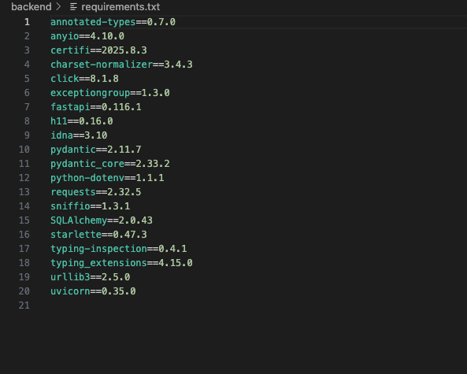
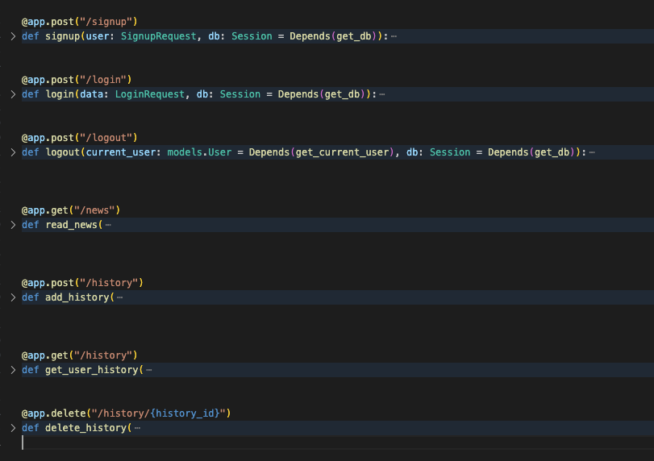
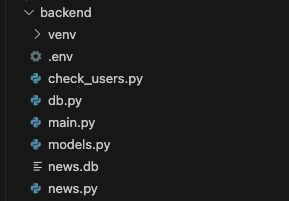
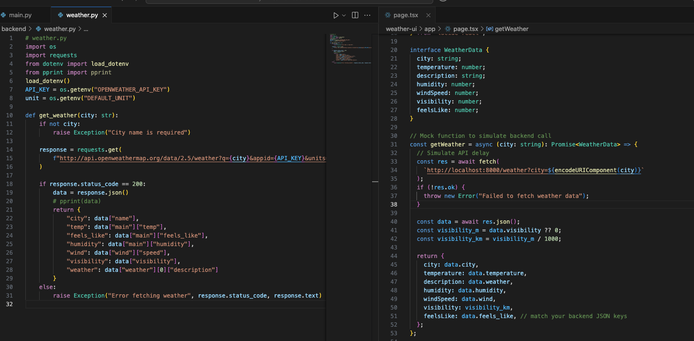
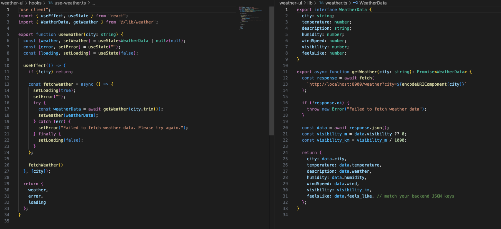
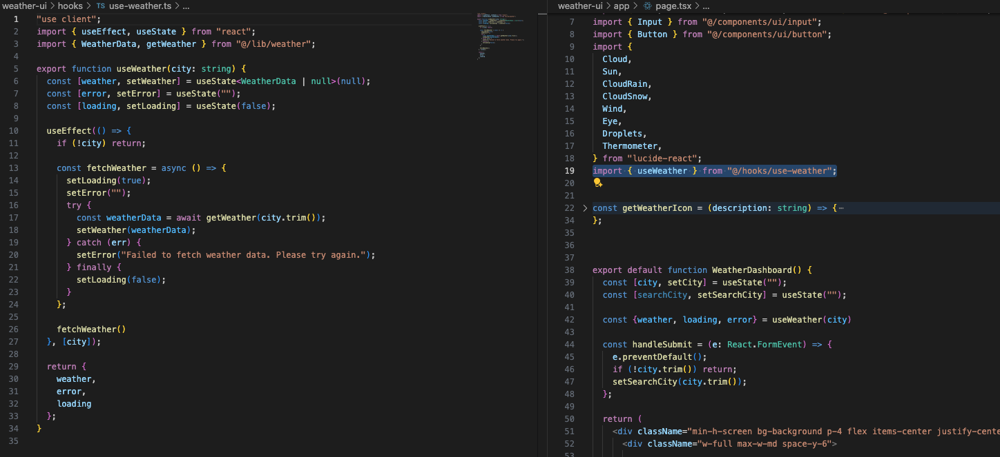

# Get Your Hands Dirty: How I Used APIs to Bring Real Data Into My Websites (and Why Every Beginner Should Practice With Them)

You’ve built pixel-perfect pages with HTML and CSS. Then JavaScript, then React, then Next.js.
Each step feels like progress — until you run into one of the most intimidating walls in programming: APIs.
Do I understand enough to start?
Should I dive into one more tutorial?
I wrestled with those exact doubts — and the best way I found through them wasn’t another course.
It was building.
In this case study, I’ll share three simple projects where I got my hands dirty with APIs: a Weather Dashboard, a Movie Picker, and a News App. Each project pushed me a little further in understanding not just how to fetch data, but also how to structure it, secure it, and actually make it useful.

### Objectives
1. Understand the role of APIs in frontend and backend development.
2. Strengthen fundamentals by applying real data.
3. Simplify API concepts for beginners through practical examples.

### Tools Used
- APIs: OpenWeather, TMDB (Movies), NewsAPI
- Backend: Python (FastAPI)
- Frontend: React & Next.js

### Key Learnings

__Environment Variables__

When I first started working with APIs, I thought the only important thing was getting data to show up on my website. But soon, I realized there’s more to it than just connecting and displaying information. APIs use keys to let us access data — kind of like a password.
Thank god, I was able to skip one of the rookie mistakes of  pasting those keys directly into my code (rookie mistake). I am aware that anyone who saw my code could steal that key and use it. That’s when I learned about something called environment variables — and they completely changed how I handle security.
I now think of the .env file as my website’s safety vault. It’s where I store sensitive data like API keys, units, or database URLs — basically, anything I don’t want to expose publicly. Then, I use Python’s dotenv library to safely load those values when I need them.

```python
from dotenv import load_dotenv

load_dotenv()
API_KEY = os.getenv("OPENWEATHER_API_KEY")
unit = os.getenv("DEFAULT_UNIT") 

```

This small practice made a big difference in my projects by using it to protect my API keys while fetching real-time weather data.

These are the things I would like to explore more in my future projetcs:
- manage multiple APIs more safely 
- handle multiple environment setups 


__Error Handling__

Responses are how we get data from an API — and they need to be handled with care. They can work for you or against you, depending on how you manage them.
When I first started experimenting with my Weather Dashboard, the data was pretty simple. It returned a clean, easy-to-read set of information like this:


If I wanted a specific value, I could just do something like:

```python
data["main"]["humidity"]
```
And that was it. It worked perfectly.

But when I moved on to my Watch-Pick Project, things got a little more complicated.


This time, the data came wrapped inside a list of dictionary. I had to slow down and really study the structure before accessing it. Otherwise, I’d end up with frustrating errors or missing values.
So before exposing anything on my site, I started checking if the data existed first — like this:
```python
 movies = []
    if "Search" in data:
        for movie in data["Search"]:
            movies.append({
                "imdbID": movie["imdbID"],
                "Title": movie["Title"],
                "Year": movie["Year"],
                "Type": movie["Type"],
                "Poster": movie["Poster"]
            })
```
That small step made a huge difference. I learned that checking whether your API response is a dictionary or a list of dictionaries can save you from hours of debugging.

Here’s what helped me figure things out:
- Using pprint() to manually inspect the data and understand its structure.
- Reading the API documentation (which I used to skip at first) to know what kind of response to expect.

These lessons became even more important when I built my Everyday News project, where API responses changed depending on user input. I realized that error handling isn’t just about fixing bugs — it’s about preventing them before they happen.

**_Try–Catch Method_**

This is probably the most useful error-handling concept I learned throughout these projects.
At first, I was hesitant to use it — I honestly thought a simple if or try-except block would be enough. But I quickly realized that working with API data is unpredictable. It’s coming from a third-party source, and if that source ever changes, I don’t want my website to just collapse or display nothing. 

Examples:

**_without try-catch method_**

```python
  useEffect(() => {
    if (!city) return;

    const fetchWeather = async () => {
      setLoading(true);
      setError("");
        const weatherData = await getWeather(city.trim());
        setWeather(weatherData);
    };

    fetchWeather()
  }, [city]);
```


**_Result_**


_(website silently failing)_

**_with try-catch method_**

```python
  useEffect(() => {
    if (!city) return;

    const fetchWeather = async () => {
      setLoading(true);
      setError("");         
      try {
        const weatherData = await getWeather(city.trim());
        setWeather(weatherData);
      } catch (err) {
        setError("Failed to fetch weather data. Please try again.");
      } finally {
        setLoading(false);
      }
    };
```


**_Result_**


_(user can see why it's not loading)_

In these examples, I learned how to catch specific errors. When an API changes its data structure or removes a key, a simple mistake can break the whole app. That’s where a try–except block helps — it lets me handle errors gracefully instead of crashing.
I didn’t use it much in my early projects, but now I see how valuable it is. It not only prevents random errors but also gives users clear feedback. Honestly, it’s one of those lessons you only understand after breaking your code a few times — and that’s how I learned it.


__Dependencies__

The reason I want to share this is because I know how scary it feels to open an old project and barely remember what dependencies you used before. It’s like opening a time capsule of code and thinking, “What was I even doing here?” 😅
One simple technique I learned to make revisiting old projects less intimidating is to create a file that lists all the dependencies I installed.



This file, usually called requirements.txt, acts like a project memory. It keeps track of every library or package your project depends on — so you don’t have to.
Next time you revisit your project, you can easily set up your environment again using just one command: ```pip install -r requirements.txt```
That single line installs everything you need, saving you from the hassle of guessing which versions or libraries you used months ago.

I didn’t realize how helpful this was until I started switching between my Weather Dashboard, Movie Picker, and Everyday News projects. Each one had different dependencies, and this method helped me stay organized and confident when jumping between them.

__Endpoints__

I was really confused with endpoints before, but as I went through my projects and doing some reasearch, I found out that endpoint is where we expose our data — kind of like a door that leads to a specific service.
If you think of an API as a big building with different departments, each endpoint is a specific door you knock on to request something. For example, one endpoint might give you news headlines, another might return history details, and another might fetch daily news articles.
Each endpoint has its own unique URL and purpose. When we send a request to that endpoint, we’re basically saying:
“Hey, I’d like this specific piece of data, please.”

**_sample endpoint photo_**



Understanding endpoints helped me visualize how the frontend communicates with the backend.

### Breakthroughs

This is where it all gets dirty.
I’ve documented each project perfectly, and this is one of those moments every beginner says, “I’ve finally done it.”
But hear me out, this is just the beginning of the real work.
I went through each of my projects and looked at them from another perspective. I would’ve never been able to finish these without documentation, online resources, and tools like ChatGPT.
So, this part where I take time to analyze my own implementations and ask the big questions (“Why?”, “What?”, and “How?”) is incredibly important, especially for a beginner.

__The Courage to Ask Questions__

Being open to criticism is key to consistency. But if you’re self-taught like me, you know how intimidating “questions” can be.
Almost every question you could think of already has an answer online — so why bother asking?�Because asking yourself questions builds comprehension.

Here are some of the questions I formed while reviewing my Weather Dashboard project:
- What is .env really for?
- How important are API keys in my website?
- What will happen if I hardcode my API keys?
- How was I able to expose data from an API?

These might sound basic to others, but getting comfortable questioning your own implementation, no matter how “dumb” it sounds — pays off in the long run.
You don’t have to memorize everything. Just understand enough to not get lost in your own code.
When I code now, I ask:
- What do I need? 
- What am I trying to accomplish here?

Knowing my priorities helps me write better algorithms and make more intentional decisions.

__A Mental Note I Keep to Guide Myself in Backend Work__

I ask myself these questions:
- What data do I want to present?
- Where is the data coming from?
- Which data do I want to persist?
- Where will this data live?
- How will I expose or access this data?

When I started diving into backend development a month ago, my main struggle was separation of concerns.
Unlike frontend — where each component has its own file — it’s easy to get lost when bridging backend and frontend. Asking these questions became my flashlight in a dark tunnel.

By answering those questions, I ended up with this file system in my everyday news project: 



The answers to these questions help define key aspects of the project, such as:
 
- What response are we expecting? 
- What APIs do we need? 
- What data models will we use in our database? 
- What endpoints will expose the data? 
- How many helper functions will we need for frontend integrations?

__When Do We Stop Improving?__

In every industry, people say, “Never stop improving.” And I agree, but as I finished my projects and continued documenting and analyzing them, I realized there’s another layer to that advice.



Take these for example — you might wonder why I have two helper functions fetching the same data. The left is my backend function for fetching data from the API key, and the right is the actual frontend page where I display the weather data I fetched.
It works fine, so a beginner like me wouldn’t notice the redundancy if I hadn’t taken the time to review it.
I did this frontend with the help of AI. Since my main goal was to understand APIs, I didn’t mind skipping the boilerplate. But now I can see that I didn’t use my own helper function — meaning I can’t really call this a “successful” implementation yet.

So, I made it my goal to refactor and correct this mistake.

I started by answering my own mental note. Since this is a simple project, I only needed one helper function to make the data accessible in the frontend, and a useWeather hook to organize it and make it reusable.



Then I used them in my page.tsx.



From the weather.ts to useWeather, I built this workflow using the questions I asked myself earlier.

But as I refactored, another question hit me: How do I avoid repeating these mistakes in the future?
I started questioning everything —Can I do it without hooks? What if I put the helper in main.py? Why do I need a backend helper if I can do it in frontend?
I could spend another day answering all these, but at some point, I had to pause and ask, _what’s my real goal here?_
The main thing is, I just want to be able to spot my weaknesses and learn from them.
Having the ability to identify mistakes and bugs is important, but forgiving your beginner self is just as essential.
You have to weigh your options and look past imperfections in your code so you can move forward. Not because you don’t want to improve — but because by moving forward, you get to apply what you learned in new projects and opportunities.

Areas I Aim to Improve Next
1. Error handling
2. Separation of concerns
3. Explaining trade-offs in tool choices

### Conclusion

I could’ve spent more time perfecting each project for my portfolio. But that wasn’t the goal.
Instead, I chose to spend my time questioning and documenting my process.
I believe the key to understanding any concept is to get your hands dirty and just do it — even through confusion and doubt.
These projects taught me that API are not just a technical tool, they are bridge between ideas and real world data. Understanding it’s about understanding how data moves, how systems connect, and allowing yourself to pause and ask question will strengthen your  fundamentals more than just building projects. So get your hands dirty, experiment, break things, and learn from them. That’s how you truly understand the role of APIs,  not in theory, but in action.

**_Reflection_**

Looking back, I realized I actually met all my original goals for this case study. I learned how APIs play a role both in the frontend and backend by building projects that connect the two. I strengthened my fundamentals not by reading more tutorials, but by handling real data — breaking things, fixing them, and understanding how each part communicates. Most importantly, I simplified API concepts in a way that beginners like me could relate to. I didn’t just code; I documented the confusion, mistakes, and breakthroughs that came with it. That, to me, is the real proof of progress.

