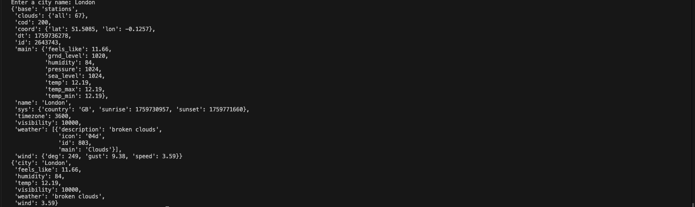
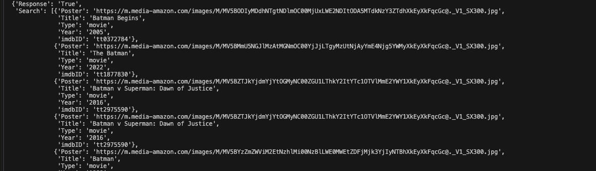
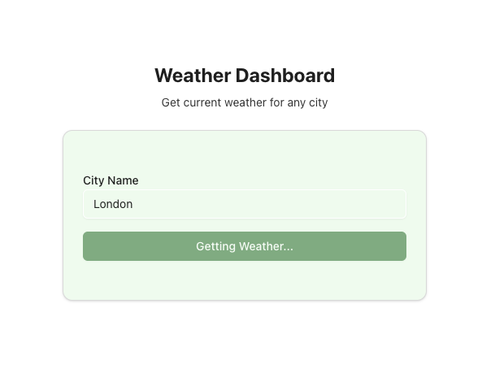
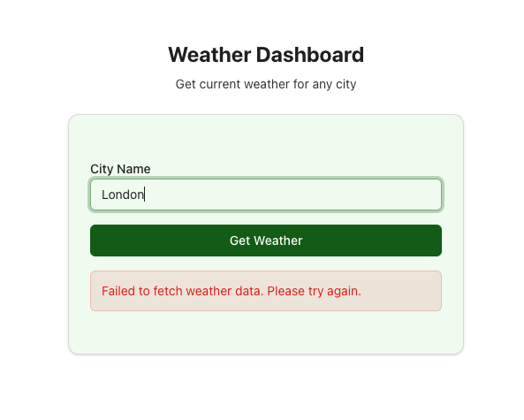

# Get Your Hands Dirty: How I Used APIs to Bring Real Data Into My Websites (and Why Every Beginner Should Practice With Them)

You’ve built pixel-perfect pages with HTML and CSS. Then JavaScript, then React, then Next.js.
Each step feels like progress — until you run into one of the most intimidating walls in programming: APIs.
Do I understand enough to start?
Should I dive into one more tutorial?
I wrestled with those exact doubts — and the best way I found through them wasn’t another course.
It was building.
In this case study, I’ll share three simple projects where I got my hands dirty with APIs: a Weather Dashboard, a Movie Picker, and a News App. Each project pushed me a little further in understanding not just how to fetch data, but also how to structure it, secure it, and actually make it useful.

### Objectives
1. Understand the role of APIs in frontend and backend development.
2. Strengthen fundamentals by applying real data.
3. Simplify API concepts for beginners through practical examples.

### Tools Used
* APIs: OpenWeather, TMDB (Movies), NewsAPI
* Backend: Python (FastAPI)
* Frontend: React & Next.js

### Key Learnings

__Environment Variables__

When I first started working with APIs, I thought the only important thing was getting data to show up on my website. But soon, I realized there’s more to it than just connecting and displaying information. APIs use keys to let us access data — kind of like a password.
Thank god, I was able to skip one of the rookie mistakes of  pasting those keys directly into my code (rookie mistake 😅). I am aware that anyone who saw my code could steal that key and use it. That’s when I learned about something called environment variables — and they completely changed how I handle security.
I now think of the .env file as my website’s safety vault. It’s where I store sensitive data like API keys, units, or database URLs — basically, anything I don’t want to expose publicly. Then, I use Python’s dotenv library to safely load those values when I need them.

```python
from dotenv import load_dotenv

load_dotenv()
API_KEY = os.getenv("OPENWEATHER_API_KEY")
unit = os.getenv("DEFAULT_UNIT") 

```

This small practice made a big difference in my projects by using it to protect my API keys while fetching real-time weather data.

These are the things I would like to explore more in my future projetcs:
- manage multiple APIs more safely 
- handle multiple environment setups 


__Error Handling__

Responses are how we get data from an API — and they need to be handled with care. They can work for you or against you, depending on how you manage them.
When I first started experimenting with my Weather Dashboard, the data was pretty simple. It returned a clean, easy-to-read set of information like this:



If I wanted a specific value, I could just do something like:

```python
data["main"]["humidity"]
```
And that was it. It worked perfectly.

But when I moved on to my Watch-Pick Project, things got a little more complicated.



This time, the data came wrapped inside a list of dictionary. I had to slow down and really study the structure before accessing it. Otherwise, I’d end up with frustrating errors or missing values.
So before exposing anything on my site, I started checking if the data existed first — like this:
```python

 movies = []
    if "Search" in data:
        for movie in data["Search"]:
            movies.append({
                "imdbID": movie["imdbID"],
                "Title": movie["Title"],
                "Year": movie["Year"],
                "Type": movie["Type"],
                "Poster": movie["Poster"]
            })
```
That small step made a huge difference. I learned that checking whether your API response is a dictionary or a list of dictionaries can save you from hours of debugging.

Here’s what helped me figure things out:
- Using pprint() to manually inspect the data and understand its structure.
- Reading the API documentation (which I used to skip at first 😅) to know what kind of response to expect.

These lessons became even more important when I built my Everyday News project, where API responses changed depending on user input. I realized that error handling isn’t just about fixing bugs — it’s about preventing them before they happen

**_Try–Catch Method_**

This is probably the most useful error-handling concept I learned throughout these projects.
At first, I was hesitant to use it — I honestly thought a simple if or try-except block would be enough. But I quickly realized that working with API data is unpredictable. It’s coming from a third-party source, and if that source ever changes, I don’t want my website to just collapse or display nothing.
Imagine this: the API changes the structure of its data, or removes a key you’re trying to access. Without proper error handling, your whole app could break. That’s where a try–catch (or try–except) block comes in. It allows us to predict and manage errors gracefully when unexpected things happen.
Not gonna lie — I didn’t fully maximize this method in my three projects. I only used it a few times here and there. But looking back, I wish I had used it more often. It could’ve saved me from a few frustrating debugging sessions 😅.

Examples:

**_without try-catch method_**

```python
  useEffect(() => {
    if (!city) return;

    const fetchWeather = async () => {
      setLoading(true);
      setError("");
        const weatherData = await getWeather(city.trim());
        setWeather(weatherData);
    };

    fetchWeather()
  }, [city]);
```

**_Result_**




**_with try-catch method_**

```python
  useEffect(() => {
    if (!city) return;

    const fetchWeather = async () => {
      setLoading(true);
      setError("");         
      try {
        const weatherData = await getWeather(city.trim());
        setWeather(weatherData);
      } catch (err) {
        setError("Failed to fetch weather data. Please try again.");
      } finally {
        setLoading(false);
      }
    };
```

**_Result_**



In this two example, I learned how to catch specific errors, which made debugging much easier. This approach doesn’t just prevent random crashes — it also improves the user experience by showing clear feedback instead of silent failures.
It’s one of those lessons that only makes sense after you’ve broken your code a few times — and that’s exactly how I learned it.


